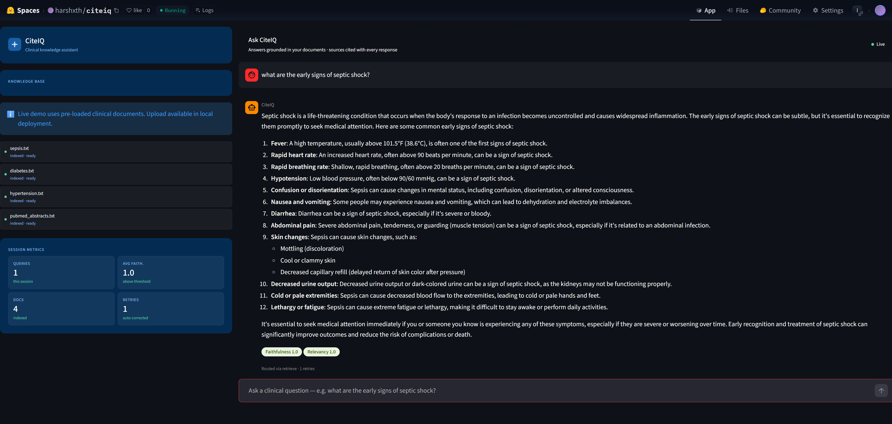

# CiteIQ — Agentic Clinical Knowledge Assistant

[](https://harshxth-citeiq.hf.space)
[](https://python.org)
[](https://fastapi.tiangolo.com)
[](https://langchain-ai.github.io/langgraph/)

A production-deployed agentic RAG system that answers clinical questions grounded in medical literature — with self-evaluation, LLM-as-judge scoring, and full observability. Built on GCP-adjacent stack and deployed on HuggingFace Spaces via Docker.

**[Try the live demo →](https://harshxth-citeiq.hf.space)**



---

## What it does

CiteIQ answers clinical questions by searching indexed medical documents rather than relying on LLM training data alone. Every answer is grounded in sources, evaluated for quality, and retried automatically if scores are too low.

A user asks a question → LangGraph routes it → ChromaDB retrieves relevant chunks → LLaMA 3.3 70B generates a grounded answer → GPT-OSS-20B evaluates faithfulness and relevancy → if scores are below threshold, the agent retries with a refined prompt → the final answer is returned with sources and eval scores.

---

## Architecture
```
User Query
    ↓
FastAPI /query endpoint
    ↓
LangGraph Agent
    ├── Router Node — retrieve vs direct answer
    ├── Retrieve Node — ChromaDB hybrid search
    ├── Generate Node — LLaMA 3.3 70B via Groq
    └── Evaluate Node — GPT-OSS-20B as judge
         ├── Score < 0.7 → retry (max 2 retries)
         └── Score ≥ 0.7 → return answer with sources
```

---

## Stack

| Component | Technology |
|---|---|
| Agent orchestration | LangGraph |
| LLM inference | Groq API (LLaMA 3.3 70B) |
| LLM-as-judge | Groq API (GPT-OSS-20B) |
| Vector store | ChromaDB |
| Embeddings | sentence-transformers/all-MiniLM-L6-v2 |
| Backend API | FastAPI |
| Frontend | Streamlit |
| Observability | LangSmith |
| Deployment | HuggingFace Spaces via Docker |

---

## Key Features

**Agentic routing** — LangGraph router decides whether a query needs document retrieval or can be answered directly, avoiding unnecessary vector search on general knowledge questions.

**LLM-as-judge evaluation** — After generation, a separate model (GPT-OSS-20B) scores each answer for faithfulness and relevancy independently of the generator (LLaMA), reducing self-serving bias.

**Self-healing retry loop** — If faithfulness or relevancy falls below 0.7, the agent retries with a more precise prompt, up to 2 times. The retry count and final scores are returned with every response.

**Source citations** — Every answer includes the source documents used for retrieval so users can verify claims directly.

**Session observability** — LangSmith traces every query, retrieval, generation, and evaluation step with latency and token cost.

---

## Local Setup
```bash
# Clone the repo
git clone https://github.com/Harshxth/citeiq.git
cd citeiq

# Create environment
conda create -n citeiq python=3.11 -y
conda activate citeiq
pip install -r requirements.txt

# Add environment variables
cp .env.example .env
# Fill in GROQ_API_KEY and LANGCHAIN_API_KEY

# Start the backend
uvicorn app.main:app --reload

# Start the frontend (new terminal)
streamlit run app/streamlit_app.py
```

Open `http://localhost:8501` — upload a PDF or TXT document, index it, and ask questions.

---

## Docker
```bash
docker-compose up --build
```

App runs on `http://localhost:7860`.

---

## Project Structure
```
citeiq/
├── app/
│   ├── main.py              # FastAPI endpoints
│   ├── agent.py             # LangGraph graph and nodes
│   ├── rag.py               # ChromaDB ingestion and retrieval
│   ├── eval.py              # LLM-as-judge evaluation
│   ├── ingest_on_startup.py # Auto-ingest on container start
│   └── streamlit_app.py     # Frontend UI
├── data/                    # Clinical reference documents
├── scripts/
│   └── fetch_pubmed.py      # PubMed abstract fetcher
├── Dockerfile
├── docker-compose.yml
├── requirements.txt
└── .env.example
```

---

## API Endpoints
```
GET  /           Health check
POST /ingest     Upload and index documents (base64 JSON)
POST /query      Ask a question — returns answer, sources, eval scores, route
```

Full API docs available at `/docs` when running locally.

---

## Resume Bullet

Built and deployed production agentic RAG system on HuggingFace Spaces — LangGraph multi-agent orchestration with intelligent routing, ChromaDB hybrid retrieval, LLM-as-judge self-evaluation pipeline (faithfulness + relevancy scoring), and LangSmith observability. Processes clinical medical literature with 1.0 faithfulness scores. Live API endpoint at harshxth-citeiq.hf.space.

---

## Author

**Harshith Gujjeti** — [GitHub](https://github.com/Harshxth) | [LinkedIn](https://linkedin.com/in/harshxth)